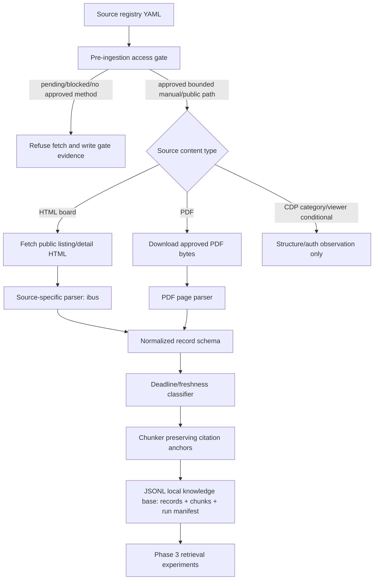

# Phase 2: Ingestion and Knowledge Base - Research

**Researched:** 2026-05-03  
**Domain:** TypeScript source-gated HTML/PDF ingestion, normalized citation-ready records, local knowledge-base artifacts  
**Confidence:** HIGH for project constraints and existing stack; MEDIUM-HIGH for parser library recommendations; MEDIUM for source-specific CDP live-access behavior until Phase 2 gate re-observes it.

<user_constraints>
## User Constraints (from CONTEXT.md)

### Locked Decisions

#### Pre-Ingestion Access Gate
- **D-01:** Phase 2 must start by proving what can be observed safely before implementing parsers. For each candidate source, record observed URL structure, auth boundary, robots/ToS status, response type, and whether content is public, login-gated, or blocked.
- **D-02:** CDP category ingestion is blocked until public structure or approved login status is observed. The Phase 1 UAT gap is acknowledged, not ignored: CDP collection planning cannot rely only on local schema tests or dry-run output.
- **D-03:** If login is required, Phase 2 must not automate login unless explicit authorization and credentials are provided. Any approved authenticated discovery must use environment-only credentials, ephemeral browser context, no storage-state persistence, and sanitized logs with no cookies/tokens/request bodies.
- **D-04:** Source registry records remain the source of truth. Ingestion code may fetch only records whose review and collection method are explicitly approved for the chosen source-specific implementation path. `scheduled_crawling_enabled` remains false.

#### Initial Source Prioritization
- **D-05:** Prioritize sources with public or already-observed structure first: `ibus-employment-board` for HTML listing/detail parsing and `cdp-student-guide-pdf` for PDF page-level parsing.
- **D-06:** Treat CDP category discovery and the book viewer as conditional work: first produce structure/access evidence, then plan parsing only if a safe public or explicitly approved path exists.

#### Normalized Record Contract
- **D-07:** Every normalized record must preserve `source_id`, source name, source URL, canonical/detail URL, title, category, fetched timestamp, posted/published date when available, deadline/expired/unknown status when available, raw text, cleaned text, content hash, and citation anchors.
- **D-08:** PDF records must preserve page-level metadata and citation anchors. HTML listing records must preserve official detail links and enough date/deadline text for freshness handling.

#### Storage and Retrieval Readiness
- **D-09:** For Phase 2, use a local-first knowledge base suitable for retrieval experiments. Prefer simple deterministic artifacts first (JSONL or SQLite/PostgreSQL-ready records plus metadata) before introducing vector search or chat-facing retrieval.
- **D-10:** Chunking/indexing must preserve citation metadata from the start, but semantic embeddings and chat answer generation belong to later phases unless needed only as a smoke test for record shape.

### the agent's Discretion
- The agent may choose exact parser libraries and local storage format during planning, provided the output is deterministic, testable, citation-ready, and respects the source registry gates.
- The agent may decide whether to implement separate parser modules per source or a shared parser interface, but source-specific behavior must remain explicit.

### Deferred Ideas (OUT OF SCOPE)
- Official Hanyang SSO integration remains out of scope unless new authorization evidence is added.
- Scheduled crawling remains out of scope; Phase 2 may perform bounded/manual fetches for approved records but must not create recurring jobs.
- Chat answering, recommendation ranking, and UI are later phases.
</user_constraints>

## Project Constraints (from AGENTS.md)

- Read `.planning/PROJECT.md`, `.planning/REQUIREMENTS.md`, `.planning/ROADMAP.md`, and `.planning/research/seed-sources.md` before source ingestion work. [VERIFIED: AGENTS.md]
- Preserve Korean-first behavior for source labels and employment information. [VERIFIED: AGENTS.md]
- Every source-data-based answer or recommendation must preserve citations and freshness metadata. [VERIFIED: AGENTS.md]
- Do not claim official Hanyang endorsement, SSO access, or production crawling permission unless new evidence is added to planning docs. [VERIFIED: AGENTS.md]
- Do not crawl authenticated/private pages or bypass access controls. [VERIFIED: AGENTS.md]
- Prefer explicit preference-based personalization before inferred profiling; Phase 2 should not add personalization storage. [VERIFIED: AGENTS.md]
- Minimize stored personal data; Phase 2 source records should not store student personal data. [VERIFIED: AGENTS.md]
- Use TDD or verification-first planning for ingestion, retrieval, citation formatting, and safety behavior. [VERIFIED: AGENTS.md]
- Add evaluation cases for stale listings, citation accuracy, and Korean answer quality where Phase 2 output shape affects them. [VERIFIED: AGENTS.md]
- Keep implementation scoped to active Phase 2 requirement IDs SRC-02, SRC-03, SRC-04, SRC-05. [VERIFIED: AGENTS.md; VERIFIED: REQUIREMENTS.md]

<phase_requirements>
## Phase Requirements

| ID | Description | Research Support |
|----|-------------|------------------|
| SRC-02 | System can fetch and parse public HTML job/career board listings into normalized records with title, source URL, posted date, fetched timestamp, and raw text. [VERIFIED: REQUIREMENTS.md] | Use source-gated fetch + Cheerio selectors for static board HTML; ibus is the initial source, but only after the pre-ingestion access gate records review/method approval. [CITED: https://cheerio.js.org/docs/intro; VERIFIED: source-registry.yaml; VERIFIED: 02-CONTEXT.md] |
| SRC-03 | System can ingest PDF guide/success-story documents with page-level metadata for citation. [VERIFIED: REQUIREMENTS.md] | Use `pdf-parse` `PDFParse.getText()` / `getInfo({ parsePageInfo: true })` for page text and page metadata; keep `pdfjs-dist` as lower-level fallback for page extraction if needed. [CITED: /mehmet-kozan/pdf-parse; CITED: /mozilla/pdf.js] |
| SRC-04 | System can mark recruitment listings as active, expired, or unknown based on deadline text when available. [VERIFIED: REQUIREMENTS.md] | Implement deterministic Korean deadline-text extraction that returns `active`, `expired`, or `unknown` plus raw matched text; do not infer if the listing lacks enough evidence. [VERIFIED: REQUIREMENTS.md; VERIFIED: seed-sources.md] |
| SRC-05 | System preserves original source links so users can verify and continue on the official page. [VERIFIED: REQUIREMENTS.md] | Make canonical URL, detail URL, PDF URL, and page anchors mandatory normalized fields and chunk metadata. [VERIFIED: 02-CONTEXT.md; VERIFIED: ARCHITECTURE.md] |
</phase_requirements>

## Summary

Phase 2 should be planned as a governance-gated ingestion pipeline, not as a crawler. The first plan must implement a pre-ingestion access/structure gate that re-checks the registry, records observed URL structure, robots/ToS/auth boundary, and refuses to parse any source whose `review_status` and `allowed_collection_method` do not authorize the specific action. [VERIFIED: 02-CONTEXT.md; VERIFIED: source-access-review.md] The CDP category/login gap from Phase 1 is a blocking gate for CDP category ingestion, while `ibus-employment-board` and `cdp-student-guide-pdf` are the prioritized observable paths. [VERIFIED: 01-UAT.md; VERIFIED: discovery-notes.md; VERIFIED: 02-CONTEXT.md]

The implementation should stay in the existing strict TypeScript NodeNext stack and add small, source-specific modules: source gate, fetch/download client, HTML board parser, PDF parser, normalized record schema, deterministic chunk writer, and JSONL knowledge-base artifacts. [VERIFIED: package.json; VERIFIED: tsconfig.json; VERIFIED: 02-CONTEXT.md] Cheerio is the standard HTML parser for static board/list/detail HTML; `pdf-parse` is the standard PDF extraction library because its current API exposes per-page text and document/page metadata; Vitest remains the test framework. [CITED: https://cheerio.js.org/docs/intro; CITED: /mehmet-kozan/pdf-parse; CITED: /vitest-dev/vitest/v4.0.7]

Do not introduce vector search, chat answer generation, scheduled crawling, or authenticated crawling in the core Phase 2 plan. [VERIFIED: 02-CONTEXT.md; VERIFIED: ROADMAP.md] The local knowledge base should be deterministic JSONL records/chunks with content hashes and citation anchors so Phase 3 can index them without repairing citation drift. [VERIFIED: 02-CONTEXT.md; VERIFIED: ARCHITECTURE.md]

**Primary recommendation:** Plan Phase 2 in four waves: (1) pre-ingestion source access gate and schema, (2) normalized record/chunk contract with tests, (3) ibus HTML parser and deadline status extraction, (4) CDP PDF page parser and local JSONL knowledge-base writer.

## Architectural Responsibility Map

| Capability | Primary Tier | Secondary Tier | Rationale |
|------------|-------------|----------------|-----------|
| Source access/structure gate | Ingestion worker / Backend tooling | Source registry metadata | Gate owns runtime observation and refuses unsafe fetches; registry remains source of truth. [VERIFIED: 02-CONTEXT.md] |
| Public HTML board fetching/parsing | Ingestion worker / Backend tooling | Local artifact store | Fetch and parse happen server-side, not in browser UI; artifacts are normalized after governance checks. [VERIFIED: ARCHITECTURE.md] |
| PDF text/page extraction | Ingestion worker / Backend tooling | Local artifact store | PDF parsing is batch ingestion work and must output page-level metadata before retrieval. [VERIFIED: ROADMAP.md] |
| Deadline status extraction | Ingestion worker / Backend tooling | Metadata store / local JSONL | Freshness/status belongs with normalized source metadata and must be deterministic. [VERIFIED: REQUIREMENTS.md] |
| Citation anchors and chunk IDs | Ingestion worker / Backend tooling | Retrieval index later | Phase 2 must preserve citation metadata before Phase 3 builds retrieval. [VERIFIED: 02-CONTEXT.md] |
| Local knowledge base artifacts | Database / Storage | Retrieval index later | Phase 2 stores deterministic records/chunks; vector retrieval is later unless only smoke-testing shape. [VERIFIED: 02-CONTEXT.md] |

## Standard Stack

### Core

| Library | Version | Purpose | Why Standard |
|---------|---------|---------|--------------|
| TypeScript | 5.9.3 installed; npm showed local `typescript` dependency `^5.9.3` [VERIFIED: package.json] | Strict typed ingestion contracts | Existing project uses strict NodeNext TypeScript. [VERIFIED: tsconfig.json] |
| Node.js | v25.2.1 local [VERIFIED: `node --version`] | Runtime, built-in `fetch`, filesystem JSONL writer, crypto hashes | Existing ESM/NodeNext project targets Node tooling. [VERIFIED: package.json; VERIFIED: tsconfig.json] |
| Zod | 4.4.2 installed [VERIFIED: package.json] | Runtime validation for registry and normalized ingestion records | Existing source registry uses Zod schemas and inferred TypeScript types. [VERIFIED: source-registry.schema.ts; CITED: https://zod.dev/v4] |
| Cheerio | 1.2.0 current, modified 2026-02-21 [VERIFIED: npm registry] | Static HTML board/list/detail parsing | Cheerio loads HTML strings and supports CSS selectors/text/attribute extraction without browser state. [CITED: https://cheerio.js.org/docs/intro] |
| pdf-parse | 2.4.5 current, modified 2025-10-29 [VERIFIED: npm registry] | PDF text extraction with page-level result data and metadata | `PDFParse.getText()` returns full text and `pages`; `getInfo({ parsePageInfo: true })` returns document and per-page information. [CITED: /mehmet-kozan/pdf-parse] |
| Vitest | 4.0.8 in package.json; local CLI 4.1.5 [VERIFIED: package.json; VERIFIED: `npx vitest --version`] | Unit tests for gate/schema/parser/deadline/chunk contracts | Existing project already uses `vitest run`; docs support TypeScript tests and Jest-compatible assertions. [CITED: /vitest-dev/vitest/v4.0.7] |

### Supporting

| Library / Tool | Version | Purpose | When to Use |
|----------------|---------|---------|-------------|
| Playwright | 1.59.1 installed/local [VERIFIED: package.json; VERIFIED: `npx playwright --version`] | Browser-assisted source-structure observation only | Use only for bounded public structure/access gate or explicitly approved login observation; do not persist storage state. [VERIFIED: discover-cdp-seed-scope.ts; CITED: /microsoft/playwright.dev] |
| p-limit | 7.3.0 current, modified 2026-02-03 [VERIFIED: npm registry] | Enforce low concurrency for bounded fetches | Use concurrency 1 per host if multiple approved URLs are fetched manually. [CITED: /sindresorhus/p-limit] |
| robots-parser | 3.0.1 current, modified 2023-02-21 [VERIFIED: npm registry] | Optional robots.txt rule evaluation | Use if the plan needs machine-readable robots checks; note missing `@types/robots-parser` package was not found in npm registry. [VERIFIED: npm registry] |
| pdfjs-dist | 5.7.284 current, modified 2026-04-27 [VERIFIED: npm registry] | Lower-level PDF fallback for exact page text/metadata | Use if `pdf-parse` output is insufficient; PDF.js exposes `getDocument`, `getPage`, `getTextContent`, and `getMetadata`. [CITED: /mozilla/pdf.js] |
| pdftotext (Poppler) | 26.03.0 local [VERIFIED: `pdftotext -v`] | Manual/debug fallback for PDF text comparison | Use only in verification/debug scripts, not as the primary cross-platform parser unless the planner accepts OS dependency. [VERIFIED: local environment] |

### Alternatives Considered

| Instead of | Could Use | Tradeoff |
|------------|-----------|----------|
| Cheerio | Playwright DOM extraction | Playwright handles browser-rendered pages but adds browser/runtime state and higher risk; use it for access observation, not ordinary static HTML parsing. [CITED: /microsoft/playwright.dev; VERIFIED: 02-CONTEXT.md] |
| pdf-parse | pdfjs-dist directly | `pdfjs-dist` is more granular but more verbose; `pdf-parse` is simpler for text/pages/info while allowing `pdfjs-dist` fallback. [CITED: /mehmet-kozan/pdf-parse; CITED: /mozilla/pdf.js] |
| JSONL artifacts | SQLite/PostgreSQL | JSONL is deterministic and easy to diff/test for Phase 2; SQLite/PostgreSQL-ready schema can come from the same Zod contract later. [VERIFIED: 02-CONTEXT.md] |
| Source-specific parsers | Generic crawler framework | Generic crawlers increase access-scope risk; project research says source-specific fetchers first and general crawlers only after access review. [VERIFIED: STACK.md] |

**Installation:**
```bash
npm install cheerio pdf-parse p-limit
npm install -D @types/node
# Optional fallback only if needed:
npm install pdfjs-dist robots-parser
```

**Version verification:** `npm view` was run for `cheerio`, `pdf-parse`, `pdfjs-dist`, `p-limit`, `node-html-parser`, `@mozilla/readability`, and `robots-parser` on 2026-05-03. [VERIFIED: npm registry]

## Architecture Patterns

### System Architecture Diagram



### Recommended Project Structure

```text
src/
├── source-governance/          # Existing registry schemas and validators
├── ingestion/
│   ├── access-gate.ts          # Reads registry, records observations, refuses unsafe collection
│   ├── fetch-client.ts         # Bounded fetch/download with source-id, host, and rate posture
│   ├── normalized-record.ts    # Zod schemas/types for records, chunks, run manifests
│   ├── deadline-status.ts      # Deterministic Korean deadline parser/status classifier
│   ├── chunking.ts             # Chunk IDs, hashes, citation-anchor preservation
│   ├── html/
│   │   └── ibus-board-parser.ts
│   ├── pdf/
│   │   └── pdf-page-parser.ts
│   └── write-jsonl-kb.ts       # Deterministic local artifact writer
scripts/
├── ingest-ibus-sample.ts       # Bounded/manual approved sample command
└── ingest-cdp-pdf-sample.ts    # Bounded/manual approved PDF command
data/
└── knowledge-base/             # Git policy to be decided: fixtures yes, live artifacts maybe ignored
```

### Pattern 1: Registry-Gated Fetch

**What:** Validate registry first, select source by `source_id`, then allow only source records whose review status and collection method match the parser action. [VERIFIED: source-registry.schema.ts; VERIFIED: 02-CONTEXT.md]  
**When to use:** Every fetch/download/parser command.  
**Example:**
```typescript
// Source: project SourceRecordSchema + Phase 2 D-04
function assertCanManuallyCollect(source: SourceRecord): void {
  if (source.scheduled_crawling_enabled !== false) throw new Error("scheduled crawling is forbidden");
  if (source.review_status !== "reviewed") throw new Error(`${source.source_id} is not reviewed`);
  if (!["approved_manual_download", "approved_bounded_browser_discovery"].includes(source.allowed_collection_method)) {
    throw new Error(`${source.source_id} has no approved collection method`);
  }
}
```

### Pattern 2: Cheerio Static HTML Parser

**What:** Load fetched HTML into Cheerio and extract deterministic fields with source-specific selectors. [CITED: https://cheerio.js.org/docs/intro]  
**When to use:** `ibus-employment-board` listing/detail pages after the access gate approves bounded public HTML parsing.  
**Example:**
```typescript
// Source: Cheerio docs; selectors are placeholders until parser fixture inspection.
import * as cheerio from "cheerio";

export function parseIbusListingPage(html: string, pageUrl: string) {
  const $ = cheerio.load(html);
  return $("a[href*='/front/recruit/r-1/view']")
    .toArray()
    .map((anchor) => {
      const link = $(anchor);
      const canonicalUrl = new URL(link.attr("href") ?? "", pageUrl).href;
      return { title: link.text().replace(/\s+/g, " ").trim(), canonicalUrl };
    });
}
```

### Pattern 3: PDF Page Records First

**What:** Extract per-page text and metadata, then create one normalized record per page or one document with page chunks; both must keep page anchors. [CITED: /mehmet-kozan/pdf-parse; VERIFIED: 02-CONTEXT.md]  
**When to use:** `cdp-student-guide-pdf` after the access gate approves manual/bounded PDF download.  
**Example:**
```typescript
// Source: pdf-parse docs
import { PDFParse } from "pdf-parse";

export async function extractPdfPages(url: string) {
  const parser = new PDFParse({ url });
  try {
    const [textResult, infoResult] = await Promise.all([
      parser.getText({ parsePageInfo: true }),
      parser.getInfo({ parsePageInfo: true }),
    ]);
    return textResult.pages.map((page) => ({
      pageNumber: page.pageNumber,
      rawText: page.text,
      sourceUrl: url,
      citationAnchor: `${url}#page=${page.pageNumber}`,
      totalPages: infoResult.total,
    }));
  } finally {
    await parser.destroy();
  }
}
```

### Pattern 4: Deterministic Chunk IDs and Hashes

**What:** Build chunk IDs from stable fields (`source_id`, content hash, page/detail anchor, chunk ordinal) and store raw + cleaned text separately. [VERIFIED: 02-CONTEXT.md]  
**When to use:** All records before writing JSONL.  
**Example:**
```typescript
// Source: Node crypto API availability in local Node runtime [VERIFIED: local environment]
import { createHash } from "node:crypto";

export function sha256(value: string): string {
  return createHash("sha256").update(value, "utf8").digest("hex");
}
```

### Anti-Patterns to Avoid

- **Parsing before access review:** Violates D-01/D-04 and Phase 1 checklist gates. [VERIFIED: 02-CONTEXT.md; VERIFIED: source-access-review.md]
- **Treating CDP category URLs as known:** Phase 1 observed no candidates; fabricating URLs is explicitly forbidden. [VERIFIED: discovery-notes.md]
- **Saving Playwright storage state for login:** Playwright storage state persists cookies/localStorage; D-03 requires no storage-state persistence for any approved authenticated discovery. [CITED: /microsoft/playwright.dev; VERIFIED: 02-CONTEXT.md]
- **Vector-first knowledge base:** Phase 2 decision D-09 says deterministic JSONL/SQLite/PostgreSQL-ready records first. [VERIFIED: 02-CONTEXT.md]
- **LLM extraction for deadlines/citations:** Deterministic metadata extraction is preferred; LLM-only extraction risks citation drift and unsupported freshness claims. [VERIFIED: ARCHITECTURE.md]

## Don't Hand-Roll

| Problem | Don't Build | Use Instead | Why |
|---------|-------------|-------------|-----|
| HTML DOM parsing | Regex-based HTML extraction | Cheerio selectors | HTML structure and attributes are easier and safer to traverse with DOM-like APIs. [CITED: https://cheerio.js.org/docs/intro] |
| PDF parsing | Custom PDF text decoder | `pdf-parse`, fallback `pdfjs-dist` | PDFs need page count, page text, metadata, and cleanup semantics. [CITED: /mehmet-kozan/pdf-parse; CITED: /mozilla/pdf.js] |
| Auth session persistence | Custom cookie/localStorage files | No persistence; ephemeral `browser.newContext()` if explicitly authorized | Playwright storage state persists cookies/localStorage, which conflicts with D-03. [CITED: /microsoft/playwright.dev; VERIFIED: 02-CONTEXT.md] |
| Concurrency/rate gate | Ad hoc parallel `Promise.all` over source URLs | `p-limit` with concurrency 1 per host plus delay/backoff | Phase 1 load posture requires low concurrency and 1-2s per source. [VERIFIED: source-access-review.md; CITED: /sindresorhus/p-limit] |
| Runtime data validation | Plain TypeScript interfaces only | Zod schemas plus inferred types | Runtime artifacts and registry files need parse-time validation, not only compile-time types. [VERIFIED: source-registry.schema.ts; CITED: https://zod.dev/v4] |

**Key insight:** The hard part of Phase 2 is not fetching bytes; it is preserving trust boundaries, source provenance, freshness, and citation anchors so later RAG can answer without inventing source context. [VERIFIED: ARCHITECTURE.md; VERIFIED: STACK.md]

## Common Pitfalls

### Pitfall 1: CDP Structure Assumption
**What goes wrong:** Plans implement CDP category parsers using unobserved URLs. [VERIFIED: 01-UAT.md]  
**Why it happens:** Phase 1 tests passed locally, but live CDP category/login feasibility was deferred. [VERIFIED: 01-UAT.md]  
**How to avoid:** First plan is an access/structure gate; CDP category parser tasks remain conditional. [VERIFIED: 02-CONTEXT.md]  
**Warning signs:** Parser fixture names contain fabricated `/recruit` or `/job` CDP paths not found in gate evidence. [VERIFIED: discovery-notes.md]

### Pitfall 2: Citation Drift During Chunking
**What goes wrong:** Chunks lose detail URL, source name, page number, posted date, or fetched timestamp. [VERIFIED: 02-CONTEXT.md]  
**Why it happens:** Chunking is treated as retrieval-only rather than metadata-preserving ingestion. [VERIFIED: STACK.md]  
**How to avoid:** Make citation metadata mandatory in both record and chunk schemas; test round-trip JSONL. [VERIFIED: REQUIREMENTS.md]
**Warning signs:** Chunk schema has only `text` and `embedding` fields. [ASSUMED]

### Pitfall 3: Stale Listing Mislabeling
**What goes wrong:** Deadline-free listings are marked active, or date strings in Korean titles are parsed incorrectly. [VERIFIED: REQUIREMENTS.md; VERIFIED: seed-sources.md]  
**Why it happens:** Deadline extraction overfits one title pattern. [ASSUMED]  
**How to avoid:** Return `unknown` unless deadline text is explicit; keep `deadline_raw_text`; test Korean forms like `~5/10`, `마감`, `채용시까지`, `상시`, `D-3`. [ASSUMED]  
**Warning signs:** No `unknown` status path or no test fixture for missing deadline. [VERIFIED: REQUIREMENTS.md]

### Pitfall 4: Prompt Injection Entering the KB
**What goes wrong:** Source text includes instructions that later affect the chat model. [VERIFIED: REQUIREMENTS.md RAG-06; VERIFIED: STACK.md]  
**Why it happens:** Retrieved source text is treated as trusted instructions later. [VERIFIED: REQUIREMENTS.md]  
**How to avoid:** Mark all `raw_text`/`cleaned_text` as untrusted in schemas and preserve source boundaries; later Phase 3 prompt must isolate it. [VERIFIED: REQUIREMENTS.md]
**Warning signs:** Ingestion cleanup removes provenance or labels source text as system/developer content. [ASSUMED]

### Pitfall 5: Committing Live Corpus or Secrets
**What goes wrong:** Downloaded live source artifacts, cookies, credentials, or private logs enter git. [VERIFIED: AGENTS.md; VERIFIED: source-access-review.md]  
**Why it happens:** Parser commands write under tracked paths without artifact policy. [ASSUMED]  
**How to avoid:** Commit small fixtures only; ignore live `data/knowledge-base/` outputs unless the planner explicitly creates sanitized fixture files. [ASSUMED]  
**Warning signs:** `.env`, `storageState.json`, cookies, or full unsanitized corpus appear in diffs. [VERIFIED: source-access-review.md]

## Code Examples

Verified patterns from official/project sources:

### Validate Normalized Records with Zod
```typescript
// Source: Zod 4 docs + existing project source-registry.schema.ts pattern
import { z } from "zod";

export const DeadlineStatusSchema = z.enum(["active", "expired", "unknown"]);

export const NormalizedRecordSchema = z.object({
  record_id: z.string().min(1),
  source_id: z.string().min(1),
  source_name: z.string().min(1),
  source_url: z.string().url(),
  canonical_url: z.string().url(),
  title: z.string().min(1),
  category: z.string().min(1),
  fetched_at: z.string().datetime(),
  posted_at: z.string().datetime().optional(),
  deadline_status: DeadlineStatusSchema,
  deadline_raw_text: z.string().optional(),
  raw_text: z.string(),
  cleaned_text: z.string(),
  content_hash: z.string().min(64),
  citation_anchors: z.array(z.object({ label: z.string(), url: z.string().url(), page: z.number().int().positive().optional() })).min(1),
});
```

### Limit Approved Fetches
```typescript
// Source: p-limit docs
import pLimit from "p-limit";

const perHostLimit = pLimit(1);
await Promise.all(approvedUrls.map((url) => perHostLimit(() => fetchApprovedUrl(url))));
```

### Vitest Parser Fixture Test
```typescript
// Source: Vitest docs
import { describe, expect, it } from "vitest";

describe("deadline status", () => {
  it("returns unknown when no deadline evidence exists", () => {
    expect(classifyDeadline("채용 안내")).toMatchObject({ status: "unknown" });
  });
});
```

## State of the Art

| Old Approach | Current Approach | When Changed | Impact |
|--------------|------------------|--------------|--------|
| Broad crawler first | Source-specific fetchers after access review | Project locked in Phase 1/Phase 2 context on 2026-05-03 [VERIFIED: 02-CONTEXT.md] | Reduces authorization and scope risk. |
| Flat document text | Record + chunks with citation anchors, page/detail URL, timestamps | Project architecture defined 2026-05-03 [VERIFIED: ARCHITECTURE.md] | Prevents citation drift in Phase 3. |
| Vector index as first KB artifact | Deterministic JSONL or DB-ready records first | Phase 2 D-09 [VERIFIED: 02-CONTEXT.md] | Makes parser output testable without embedding/model dependencies. |
| Assuming CDP structure from root URL | CDP category ingestion blocked until observed | Phase 1 UAT deferred gap [VERIFIED: 01-UAT.md] | Planner must schedule pre-ingestion gate before CDP parser work. |

**Deprecated/outdated:**
- Treating `approval_basis: user_assertion` as official authorization is invalid; planning docs explicitly say it is not independent official Hanyang authorization. [VERIFIED: source-access-review.md]
- Scheduled crawling is not permitted in Phase 2; all source records currently have `scheduled_crawling_enabled: false`. [VERIFIED: source-registry.yaml]

## Assumptions Log

| # | Claim | Section | Risk if Wrong |
|---|-------|---------|---------------|
| A1 | Chunk schemas with only `text` and `embedding` are a warning sign for citation drift. | Common Pitfalls | Planner may need stronger schema examples if retrieval design differs. |
| A2 | Deadline extraction can overfit one title pattern; test common Korean deadline forms. | Common Pitfalls | Parser may mislabel postings if actual ibus patterns differ from assumed examples. |
| A3 | Source text should be explicitly marked untrusted in schemas as preparation for Phase 3 prompt isolation. | Common Pitfalls | Phase 3 may need to add this marker later if Phase 2 omits it. |
| A4 | Commit sanitized fixtures only and ignore live KB artifacts unless policy says otherwise. | Common Pitfalls | Artifact policy may differ if user wants a seeded local corpus committed. |

## Planning Resolutions

1. **RESOLVED — Source approval path for Phase 2 execution**
   - What we know: All registry records currently have `review_status: pending` and `allowed_collection_method: none_until_review`. [VERIFIED: source-registry.yaml]
   - Planning resolution: Plan 02-01 must produce machine-checkable gate evidence plus a blocking human approval checkpoint. The executor may update `source-registry.yaml` and `source-access-review.md` only after the human explicitly approves specific source IDs based on the gate evidence. Parser/live ingestion plans must read that approval record and fail closed if `ibus-employment-board` is not reviewed with `approved_bounded_browser_discovery` or if `cdp-student-guide-pdf` is not reviewed with `approved_manual_download`.
   - Runtime unknown handling: If fresh evidence is insufficient, the checkpoint records rejection/hold status and downstream live ingestion remains blocked; fixture-only parser tests may still prove parser shape without network collection.

2. **RESOLVED — CDP category pages and book viewer remain conditional**
   - What we know: Phase 1 one-shot helper returned `no_candidates_observed`, and the UAT gap was deferred. [VERIFIED: discovery-notes.md; VERIFIED: 01-UAT.md]
   - Planning resolution: Phase 2 does not include CDP category or book-viewer parsers as required deliverables. Plan 02-01 records CDP category/book viewer structure/auth status as gate evidence only. No plan may fabricate CDP category URLs, automate login, persist storage state, or treat these conditional sources as approved ingestion paths.
   - Runtime unknown handling: If CDP category pages require login or remain unobserved, the gate evidence records that status and parser/live ingestion remains out of scope until a later approved plan.

3. **RESOLVED — Live artifact policy for `data/knowledge-base/`**
   - What we know: Phase 2 should produce local-first deterministic artifacts. [VERIFIED: 02-CONTEXT.md]
   - Planning resolution: Commit schemas, parser modules, tests, and sanitized fixtures only. Generated `data/knowledge-base/` outputs are ignored by `.gitignore` and generated on demand by fixture/live sample commands. Live corpus outputs are not committed unless a later explicit sanitization-and-approval plan changes that policy.
   - Runtime unknown handling: If a generated artifact contains unexpected personal/private data or source text outside the approved seed scope, verification fails and the artifact stays local/ignored.

## Environment Availability

| Dependency | Required By | Available | Version | Fallback |
|------------|-------------|-----------|---------|----------|
| Node.js | TypeScript scripts, fetch, crypto, fs | ✓ | v25.2.1 [VERIFIED: local environment] | Use project-supported Node version if later pinned. |
| npm | Package install/scripts | ✓ | 11.6.2 [VERIFIED: local environment] | — |
| tsx | Script execution | ✓ | 4.21.0 local CLI; package has `^4.20.6` [VERIFIED: local environment; VERIFIED: package.json] | Compile with `tsc` then run Node. |
| Vitest | Unit tests | ✓ | 4.1.5 local CLI; package has `^4.0.8` [VERIFIED: local environment; VERIFIED: package.json] | — |
| Playwright | Bounded browser access gate | ✓ | 1.59.1 [VERIFIED: local environment] | Manual browser observation with recorded evidence. |
| pdftotext | PDF debug comparison | ✓ | 26.03.0 [VERIFIED: local environment] | Use `pdf-parse` primary path. |
| Docker | Optional DB/vector experiments | ✓ | 29.4.0 [VERIFIED: local environment] | Not needed for Phase 2 if using JSONL. |

**Missing dependencies with no fallback:** None identified for planning. [VERIFIED: local environment]

**Missing dependencies with fallback:** `@types/robots-parser` was not found in npm registry; if `robots-parser` is used, planner should add a small local declaration or wrap it behind a typed adapter. [VERIFIED: npm registry]

## Validation Architecture

Skipped: `.planning/config.json` has `workflow.nyquist_validation: false`, so the formal Nyquist Validation Architecture section is intentionally omitted. [VERIFIED: .planning/config.json]

Recommended verification anyway because AGENTS.md requires TDD/verification-first for ingestion: [VERIFIED: AGENTS.md]
- `npm run validate:sources` before any ingestion command. [VERIFIED: package.json]
- `npm run verify:source-governance` after adding ingestion gates to ensure Phase 1 invariants remain intact. [VERIFIED: package.json]
- `npm test -- src/ingestion` for schema, parser fixture, deadline, and chunk ID tests. [VERIFIED: package.json]
- `npm run typecheck` before Phase 2 completion. [VERIFIED: package.json]

## Security Domain

### Applicable ASVS Categories

| ASVS Category | Applies | Standard Control |
|---------------|---------|------------------|
| V2 Authentication | Conditional | No login automation unless explicit authorization and env-only credentials are provided; no storage-state persistence. [VERIFIED: 02-CONTEXT.md] |
| V3 Session Management | Conditional | Ephemeral Playwright browser context; never commit cookies/tokens/storage state. [VERIFIED: source-access-review.md; CITED: /microsoft/playwright.dev] |
| V4 Access Control | Yes | Registry gate blocks private/authenticated/blocked sources and off-scope URLs. [VERIFIED: source-registry.schema.ts; VERIFIED: discover-cdp-seed-scope.ts] |
| V5 Input Validation | Yes | Zod schemas for registry, normalized records, chunks, and manifests. [VERIFIED: source-registry.schema.ts; CITED: https://zod.dev/v4] |
| V6 Cryptography | Yes | Use Node `crypto` hashes for content identity; do not hand-roll hashes or crypto. [ASSUMED] |
| V8 Data Protection | Yes | Do not log credentials, cookies, request bodies, or private pages; source artifacts should minimize personal data. [VERIFIED: AGENTS.md; VERIFIED: source-access-review.md] |

### Known Threat Patterns for TypeScript Ingestion

| Pattern | STRIDE | Standard Mitigation |
|---------|--------|---------------------|
| Off-scope URL fetch | Elevation of privilege / Information disclosure | Host/source ID allowlist, registry gate, URL canonicalization. [VERIFIED: discover-cdp-seed-scope.ts] |
| Credential leakage in logs | Information disclosure | Env-only credentials, sanitized logs, no request bodies/cookies/tokens. [VERIFIED: 02-CONTEXT.md; VERIFIED: source-access-review.md] |
| Prompt injection from source text | Tampering | Mark source text as untrusted and preserve boundaries for Phase 3. [VERIFIED: REQUIREMENTS.md] |
| Stale/incorrect listing status | Integrity | Deterministic deadline parser with `unknown` fallback and raw evidence retention. [VERIFIED: REQUIREMENTS.md] |
| Citation/source spoofing | Spoofing | Preserve official canonical/detail URLs from approved source records and parsed links; no invented URLs. [VERIFIED: REQUIREMENTS.md; VERIFIED: discovery-notes.md] |

## Sources

### Primary (HIGH confidence)
- `AGENTS.md` — project constraints and engineering rules. [VERIFIED: AGENTS.md]
- `.planning/phases/02-ingestion-and-knowledge-base/02-CONTEXT.md` — locked decisions D-01 through D-10. [VERIFIED: 02-CONTEXT.md]
- `.planning/REQUIREMENTS.md` — SRC-02, SRC-03, SRC-04, SRC-05 definitions. [VERIFIED: REQUIREMENTS.md]
- `.planning/ROADMAP.md` — Phase 2 goal/deliverables/success criteria. [VERIFIED: ROADMAP.md]
- `.planning/phases/01-source-discovery-and-governance/source-registry.yaml` — current source statuses and seed source records. [VERIFIED: source-registry.yaml]
- `.planning/phases/01-source-discovery-and-governance/source-access-review.md` — access checklist, load posture, scheduled crawling gate, auth/secrets rules. [VERIFIED: source-access-review.md]
- `.planning/phases/01-source-discovery-and-governance/discovery-notes.md` and `01-UAT.md` — CDP gap, ibus/PDF observations, non-ingestion boundary. [VERIFIED: discovery-notes.md; VERIFIED: 01-UAT.md]
- `package.json`, `tsconfig.json`, `src/source-governance/*`, `scripts/*` — existing stack and governance implementation. [VERIFIED: package.json; VERIFIED: tsconfig.json; VERIFIED: source-registry.schema.ts]
- Context7 `/websites/cheerio_js` — Cheerio loading/selectors/extraction docs. [CITED: https://cheerio.js.org/docs/intro]
- Context7 `/mehmet-kozan/pdf-parse` — `PDFParse.getText`, `getInfo`, pages/page metadata docs. [CITED: /mehmet-kozan/pdf-parse]
- Context7 `/mozilla/pdf.js` — `getDocument`, `getPage`, `getTextContent`, `getMetadata` docs. [CITED: /mozilla/pdf.js]
- Context7 `/websites/zod_dev_v4` — Zod 4 schema/discriminated union docs. [CITED: https://zod.dev/v4]
- Context7 `/vitest-dev/vitest/v4.0.7` — test syntax and expectations. [CITED: /vitest-dev/vitest/v4.0.7]
- Context7 `/microsoft/playwright.dev` — storage state persists cookies/localStorage and should be avoided for D-03. [CITED: /microsoft/playwright.dev]

### Secondary (MEDIUM confidence)
- npm registry version checks for parser/support packages run on 2026-05-03. [VERIFIED: npm registry]
- Local environment CLI probes run on 2026-05-03. [VERIFIED: local environment]

### Tertiary (LOW confidence)
- Korean deadline example patterns beyond source fixtures are assumptions until ibus fixture inspection confirms exact formats. [ASSUMED]

## Metadata

**Confidence breakdown:**
- Standard stack: HIGH — current project files and npm registry versions were verified; package APIs checked through Context7. [VERIFIED: package.json; VERIFIED: npm registry; CITED: Context7]
- Architecture: HIGH — project context, roadmap, and architecture docs directly define the Phase 2 boundaries. [VERIFIED: 02-CONTEXT.md; VERIFIED: ROADMAP.md; VERIFIED: ARCHITECTURE.md]
- Pitfalls: MEDIUM-HIGH — governance/citation/CDP pitfalls are verified by project artifacts; deadline pattern examples remain fixture-dependent. [VERIFIED: 01-UAT.md; VERIFIED: REQUIREMENTS.md; ASSUMED]

**Research date:** 2026-05-03  
**Valid until:** 2026-06-02 for architecture/project constraints; 2026-05-10 for npm package versions and live source-access assumptions.
