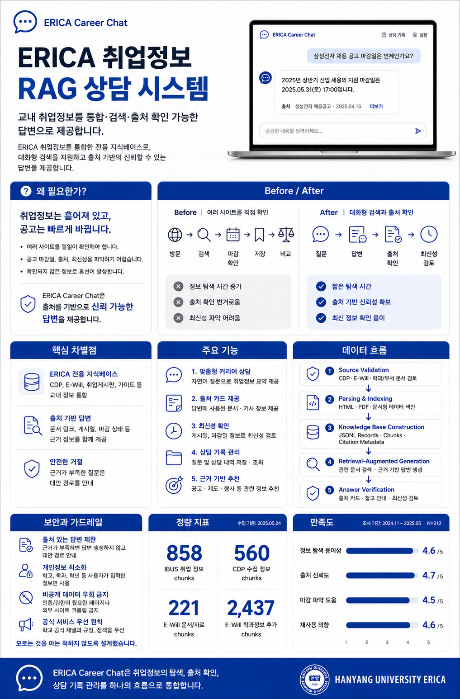

# ERICA Career Chat



ERICA Career Chat은 한양대학교 ERICA 학생을 위한 한국어 우선 취업정보 RAG 상담 서비스입니다. 교내 취업정보를 통합해 검색하고, 답변에 사용된 출처와 최신성 정보를 함께 확인할 수 있도록 설계되었습니다.

## 주요 기능

- 한국어 자연어 질문 기반 취업정보 상담
- 답변 근거가 되는 출처 카드와 최신성 메타데이터 제공
- 공고 마감일, 게시일, 출처 링크를 함께 검토하는 정보 확인 흐름
- 명시적으로 입력한 전공과 희망 직무 기반의 개인정보 최소화 추천
- 근거가 부족한 질문은 추측하지 않고 대안 경로 안내

## 기술 스택

- Next.js
- React
- TypeScript
- Tailwind CSS
- Vitest
- Playwright
- Zod
- 로컬 JSONL 지식베이스 기반 RAG 파이프라인

## 시작하기

```bash
npm install
npm run dev
```

개발 서버 실행 후 브라우저에서 `http://localhost:3000`으로 접속합니다.

## 검증 명령

```bash
npm run typecheck
npm test
npm run build:web
npm run qa:web
```
